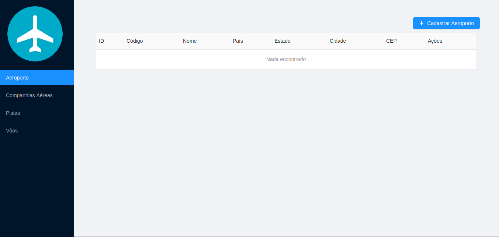

# Airport-Manager
```
This project was developed with the aim of learning React JS and Laravel technologies
```


The airport manager provides basic functionalities for airport management, the main functionalities being the following:

- Airports CRUD
- Airlines CRUD
- Runaways CRUD
- Flights Crud

```
PS: This project was made only for the purpose of learning the ReactJS and Laravel technologies
```
## Dependencies

- PHP >= 7.1.3
- MySQL 5.7 
- [Laravel 5.7 dependencies](https://laravel.com/docs/5.7/installation)
- Composer >= 1.6.5
- npm >= 6.7.0

### Installing
 
Clone and navigate to the root folder of this project

OS X & Linux:

```
composer install
```
```
Create a database in MySQL
```
```
cp .env.example .env
```
```
Open the .env and set the database settings in the following fields
DB_HOST = database Host
DB_DATABASE = database Name
DB_USERNAME = database user
DB_PASSWORD = database Password
```
```
php artisan key:generate
```
```
php artisan migrate
```
```
npm install
```
```
npm run dev
```

### Running

```
php artisan serve
```

## Built With

* [Laravel](https://laravel.com/) - Serve-side framework used
* [ReactJs](https://reactjs.org/) - JavaScript library for building user interfaces
* [Composer](https://getcomposer.org/) - Dependency manager for PHP
* [npm](https://www.npmjs.com/) - Dependency manager for Javascript
